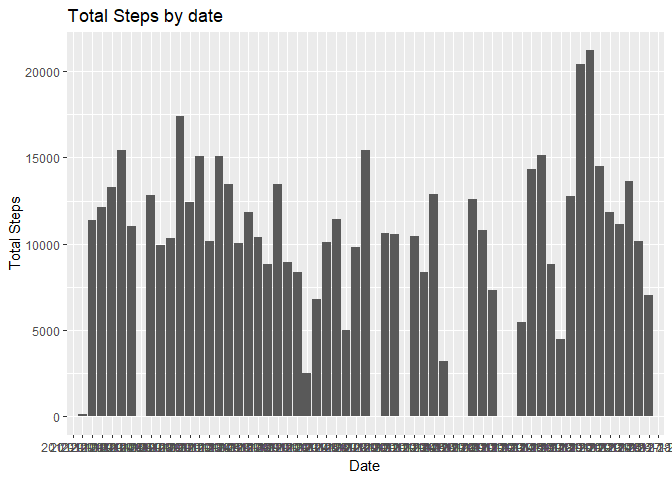
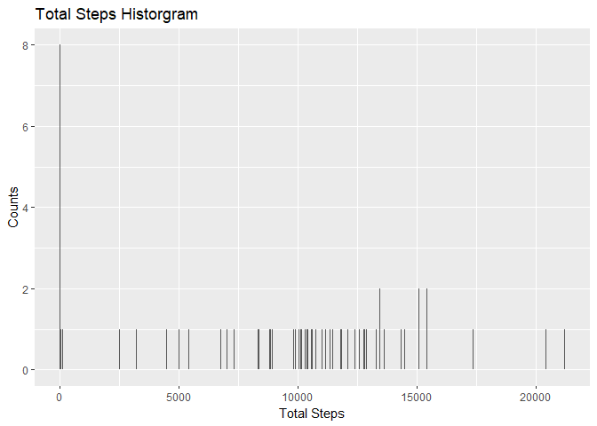
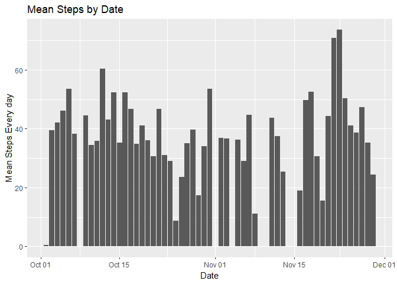
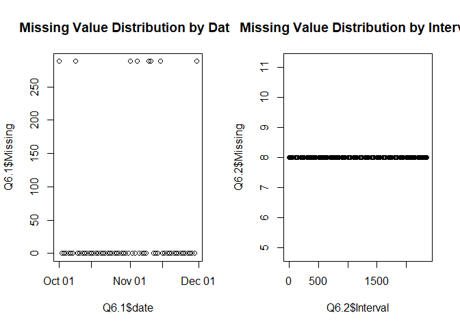
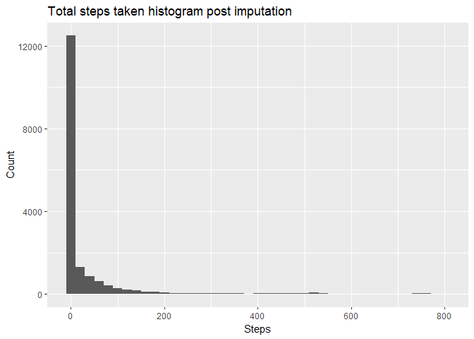
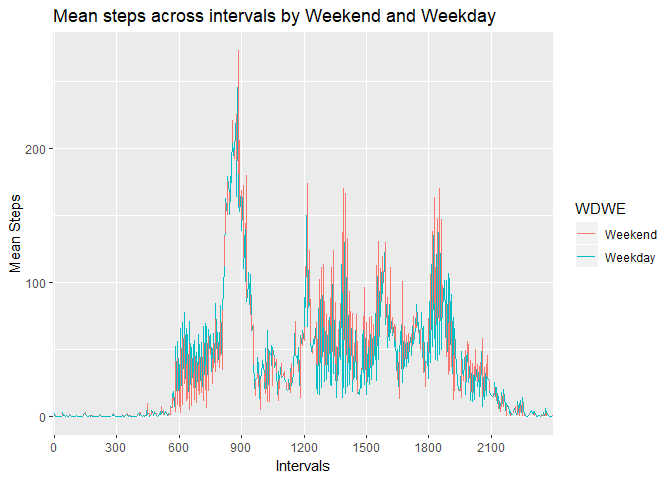
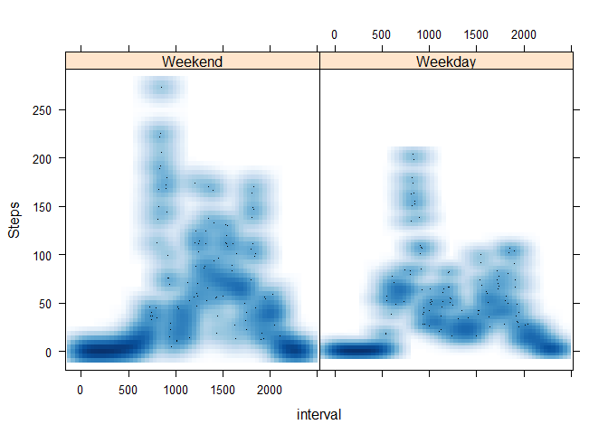
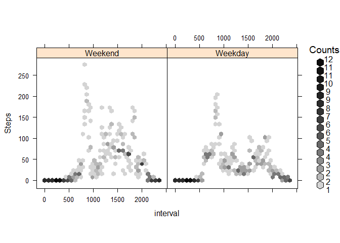

---
title: "Peer-G-A-Course Proj-1"
author: "Phillip"
Each step is a learning journey in Data Analysis and Research.

## Assignment Instructions 

1. Code for reading in the dataset and/or processing the data
2. Histogram of the total number of steps taken each day
3. Mean and median number of steps taken each day
4. Time series plot of the average number of steps taken
5. The 5-minute interval that, on average, contains the maximum number of steps
6. Code to describe and show a strategy for imputing missing data
7. Histogram of the total number of steps taken each day after missing values are imputed
8. Panel plot comparing the average number of steps taken per 5-minute interval across weekdays and weekends
9. All of the R code needed to reproduce the results (numbers, plots, etc.) in the report


## Step 1
# Code for reading in the dataset and/or processing the data

## My notes: Setwd--set the working directory. The Coursera courses are at a different working directorate from the "git/github" working directorate.  In the git working dir., we can commit, push, save as .md (if Rmd file).

##Coursera Courses "wd".
##setwd("C:/Users/Phillip.Carter1/Documents/Documents/COHORT Course Folder fy2020/Coursera Data Science Folder FY20/Data Science Courses Folder 2019-2020/Reproducible Research/Week-2")
##getwd()


## git/github "wd".
##setwd("C:/Users/Phillip.Carter1/Documents/datasciencecoursera/github.com/pcart234/Reproducible-Research")
##getwd()


## First, read in the data file at the "wd" by "read.csv" or "read.table" (if a text file) by returning it to a variable name (activity## <-  ###).  Install and library all pertinent packages.

## System.time(): system.time() function takes an arbitrary R expression as input (can be wrapped in curly
braces) and returns the amount of time taken to evaluate the expression.
## user time: time charged to the CPU(s) for this expression
## elapsed time: “wall clock” time, the amount of time that passes for you as you’re sitting there

##sys.setlocale("LC_TIME", English) is setting the locale time in R to "US" time and in English.

## Sys.setlocale("LC_TIME", "English")
## [1] "English_United States.1252"


## str() function---You can see some basic characteristics of the dataset with the dim() and str() functions.

##dim(chicago)
[1] 6940 8
> str(chicago)
'data.frame': 6940 obs. of 8 variables:
$ city : chr "chic" "chic" "chic" "chic" ...
$ tmpd : num 31.5 33 33 29 32 40 34.5 29 26.5 32.5 ...
$ dptp : num 31.5 29.9 27.4 28.6 28.9 ...
$ date : Date, format: "1987-01-01" "1987-01-02" ...


## The select() function can be used to select columns of a data frame that you want to focus on.
Often you’ll have a large data frame containing “all” of the data, but any given analysis might only
use a subset of variables or observations. The select() function allows you to get the few columns
you might need.

## the "names()" function calls for the column# and number of rows--[1, 3].

## > names(chicago)[1:3]
[1] "city" "tmpd" "dptp"

## using the select() function, we must call the argument to return a dataframe "name" and select(dataset, variable names (aaa1 : dd)). 
> subset <- select(chicago, city:dptp)
> head(subset)
city tmpd dptp
1 chic 31.5 31.500
2 chic 33.0 29.875
3 chic 33.0 27.375

##The filter() function is used to extract subsets of rows from a data frame. This function is similar
to the existing subset() function in R but is quite a bit faster in my experience.
## you must call the argument to return to a dataframe.
## chic.f <- filter(chicago, pm25tmean2 > 30)

> str(chic.f)
'data.frame': 194 obs. of 8 variables:
$ city : chr "chic" "chic" "chic" "chic" ...
$ tmpd : num 23 28 55 59 57 57 75 61 73 78 ...
$ dptp : num 21.9 25.8 51.3 53.7 52 56 65.8 59 60.3 67.1 ...
$ date : Date, format: "1998-01-17" "1998-01-23" ...
$ pm25tmean2: num 38.1 34 39.4 35.4 33.3 ...
$ pm10tmean2: num 32.5 38.7 34 28.5 35 ...
$ o3tmean2 : num 3.18 1.75 10.79 14.3 20.66

## The summary() function (summarise / summarize "verbs" in dplyr package): generate summary statistics of different variables in the data frame, possibly within strata

## the “pipe” operator %>%: is used to connect multiple verb actions together into a pipeline

## summary(chic.f$pm25tmean2)
Min. 1st Qu. Median Mean 3rd Qu. Max.
30.05 32.12 35.04 36.63 39.53 61.50

## Dates and Times 
## ## My local time zone
## x <- as.POSIXct("2012-10-25 01:00:00")
## y <- as.POSIXct("2012-10-25 06:00:00", tz = "GMT")
## > y-x
## Time difference of 1 hours


## Object      Set column names    Set row names
data frame       names()           row.names()
matrix          colnames()         rownames()


## The group_by() function is used to generate summary statistics from the data frame within strata
defined by a variable. 

## For example, in this air pollution dataset, you might want to know what the average annual level of PM2.5 is.

## So the stratum is the year, and that is something we can derive from the date variable. 

## In conjunction with the group_by() function we often use the summarize() function (or summarise() for some parts of the world).

## The general operation here is a combination of splitting a data frame into separate pieces defined by a variable or group of variables (group_by()), and then applying a summary function across those subsets (summarize()).

##(dplyr package)-First, we can create a year varible using as.POSIXlt().(Times can be coerced from a character string)

## chicago <- mutate(chicago, year = as.POSIXlt(date)$year + 1900)

## Now we can create a separate data frame that splits the original data frame by year.

## years <- group_by(chicago, year)

## Finally, we compute summary statistics for each year in the data frame with the summarize() function.

## summarize(years, pm25 = mean(pm25, na.rm = TRUE), + o3 = max(o3tmean2, na.rm = TRUE), + no2 = median(no2tmean2, na.rm = TRUE))

## A tibble: 19 × 4
year   pm25   o3      no2
<dbl> <dbl>  <dbl>    <dbl>
1 1987 NaN  62.96966 23.49369
2 1988 NaN  61.67708 24.52296
3 1989 NaN   59.72727 26.14062


```r
# Import data
setwd("C:/Users/Phillip.Carter1/Documents/datasciencecoursera/github.com/pcart234/Reproducible-Research")
getwd()
```

```
## [1] "C:/Users/Phillip.Carter1/Documents/datasciencecoursera/github.com/pcart234/Reproducible-Research"
```

```r
activity <- read.csv("activity.csv")

# libraries
library(ggplot2)
library(dplyr)
```

```
## Warning: package 'dplyr' was built under R version 3.4.4
```

```
## 
## Attaching package: 'dplyr'
```

```
## The following objects are masked from 'package:stats':
## 
##     filter, lag
```

```
## The following objects are masked from 'package:base':
## 
##     intersect, setdiff, setequal, union
```

```r
Sys.setlocale("LC_TIME", "English")
```

```
## [1] "English_United States.1252"
```

```r
# some information about the variables
str(activity)
```

```
## 'data.frame':	17568 obs. of  3 variables:
##  $ steps   : int  NA NA NA NA NA NA NA NA NA NA ...
##  $ date    : Factor w/ 61 levels "2012-10-01","2012-10-02",..: 1 1 1 1 1 1 1 1 1 1 ...
##  $ interval: int  0 5 10 15 20 25 30 35 40 45 ...
```

```r
summary(activity)
```

```
##      steps                date          interval     
##  Min.   :  0.00   2012-10-01:  288   Min.   :   0.0  
##  1st Qu.:  0.00   2012-10-02:  288   1st Qu.: 588.8  
##  Median :  0.00   2012-10-03:  288   Median :1177.5  
##  Mean   : 37.38   2012-10-04:  288   Mean   :1177.5  
##  3rd Qu.: 12.00   2012-10-05:  288   3rd Qu.:1766.2  
##  Max.   :806.00   2012-10-06:  288   Max.   :2355.0  
##  NA's   :2304     (Other)   :15840
```


## Step 2
# Histogram of the total number of steps taken each day

## My Notes:  

## we load "ggplot2", then assign dataframe (dataset) to the data.frame() function.  

##Data frames are used to store tabular data in R. Data frames are represented as a special type of list where every element of the list has to have the same length. Each element of the list can be thought of as a column and the length of each element of the list is the number of rows.

## Unlike matrices, data frames can store different classes of objects in each column. Matrices must have every element be the same class (e.g. all integers or all numeric).

## In addition to column names, indicating the names of the variables or predictors, data frames have a special attribute called row.names which indicate information about each row of the data frame.

## Data frames are usually created by reading in a dataset using the read.table() or read.csv().

## Data frames can be converted to a matrix by calling data.matrix(). While it might seem that the as.matrix() function should be used to coerce a data frame to a matrix, almost always, what you want is the result of data.matrix().

View(activity)
## tapply(): is used to apply a function over subsets of a vector. It can be thought of as a combination of split() and sapply() for vectors only. I’ve been told that the “t” in tapply() refers to “table”, but that is unconfirmed.

## str(tapply)
function (X, INDEX, FUN = NULL, ..., simplify = TRUE)

  The arguments to tapply() are as follows:
• X is a vector
• INDEX is a factor or a list of factors (or else they are coerced to factors)
• FUN is a function to be applied
• … contains other arguments to be passed FUN
• simplify, should we simplify the result?

## Given a vector of numbers, one simple operation is to take group means.
## Simulate some data
> x <- c(rnorm(10), runif(10), rnorm(10, 1))

## Define some groups with a factor variable
> f <- gl(3, 10)
> f
[1] 1 1 1 1 1 1 1 1 1 1 2 2 2 2 2 2 2 2 2 2 3 3 3 3 3 3 3 3 3 3
Levels: 1 2 3

## tapply(x, f, mean)
1 2 3
0.1896235 0.5336667 0.9568236

## tapply(x, f, range)
$`1`
[1] -1.869789 1.497041


## R objects can have attributes, which are like metadata for the object. These metadata can be very
useful in that they help to describe the object. For example, column names on a data frame help to
tell us what data are contained in each of the columns. Some examples of R object attributes are
• names, dimnames
• dimensions (e.g. matrices, arrays)
• class (e.g. integer, numeric)
• length
• other user-defined attributes/metadata
Attributes of an object (if any) can be accessed using the attributes() function. Not all R objects
contain attributes, in which case the attributes() function returns NULL.


The c() function can be used to create vectors of objects by concatenating things together.
> x <- c(0.5, 0.6) ## numeric
> x <- c(TRUE, FALSE) ## logical
> x <- c(T, F) ## logical
> x <- c("a", "b", "c") ## character
> x <- 9:29 ## integer
> x <- c(1+0i, 2+4i) ## complex

You can also use the vector() function to initialize vectors.
> x <- vector("numeric", length = 10)
> x
[1] 0 0 0 0 0 0 0 0 0 0

Objects can be explicitly coerced from one class to another using the as.* functions, if available.

> x <- 0:6
> class(x)
[1] "integer"
> as.numeric(x)
[1] 0 1 2 3 4 5 6
> as.logical(x)
[1] FALSE TRUE TRUE TRUE TRUE TRUE TRUE
> as.character(x)
[1] "0" "1" "2" "3" "4" "5" "6"

Lists can be explicitly created using the list() function, which takes an arbitrary number of
arguments.
> x <- list(1, "a", TRUE, 1 + 4i)
> x
[[1]]
[1] 1


We can also create an empty list of a prespecified length with the vector() function
> x <- vector("list", length = 5)
> x
[[1]]
NULL

## na.rm is a logical indicating whether missing values should be removed or not. (na.rm = TRUE) or FALSE)


## Use the Data Visualization with ggplot2 "Cheat Sheet" for plot information.


```r
library(ggplot2)
Q2<-data.frame(tapply(activity$steps,activity$date,sum,na.rm=TRUE))
Q2$date<-rownames(Q2)
rownames(Q2)<-NULL
names(Q2)[[1]]<-"Total Steps"
png("plot1.png")

# Total Steps by date bar chart
ggplot(Q2,aes(y=Q2$`Total Steps`,x=Q2$date))+geom_bar(stat="identity") + ylab("Total Steps")+xlab("Date")+ggtitle("Total Steps by date")
dev.off()
```

```
## png 
##   2
```

```r
ggplot(Q2,aes(y=Q2$`Total Steps`,x=Q2$date))+geom_bar(stat="identity") + ylab("Total Steps")+xlab("Date")+ggtitle("Total Steps by date")
```

<!-- -->

```r
# Histogram of total steps
qplot(Q2$`Total Steps`,geom="histogram", binwidth = 20, xlab="Total Steps",ylab="Counts",main="Total Steps Historgram")
```

<!-- -->

```r
png("plot1.1.png")
qplot(Q2$`Total Steps`,geom="histogram", binwidth = 20, xlab="Total Steps",ylab="Counts",main="Total Steps Historgram")
dev.off()
```

```
## png 
##   2
```


## Step 3
# Mean and median number of steps taken each day

## My notes:
Note that for data frames, there is a separate function for setting the row names, the row.names()
function. Also, data frames do not have column names, they just have names (like lists). So to set
the column names of a data frame just use the names() function. Yes, I know its confusing. Here’s a
quick summary:
Object      Set column names      Set row names
data frame     names()            row.names()
matrix       colnames()           rownames()  
  
 m <- matrix(1:4, nrow = 2, ncol = 2)
> dimnames(m) <- list(c("a", "b"), c("c", "d"))
> m
Column names and row names can be set separately using the colnames() and rownames() functions.
> colnames(m) <- c("h", "f")
> rownames(m) <- c("x", "z")
> m
  
For statistical analysis, load dplyr, statr, etc.


## The mutate() function exists to compute transformations of variables in a data frame. Often, you want to create new variables that are derived from existing variables and mutate() provides a clean interface for doing that.

## For example, with air pollution data, we often want to detrend the data by subtracting the mean from the data. That way we can look at whether a given day’s air pollution level is higher than or less than average (as opposed to looking at its absolute level).

## Here we create a pm25detrend variable that subtracts the mean from the pm25 variable.

chicago <- mutate(chicago, pm25detrend = pm25 - mean(pm25, na.rm = TRUE))
> head(chicago)
city tmpd dewpoint date pm25 pm10tmean2 o3tmean2 no2tmean2
1 chic 35 30.1 2005-12-31 15.00000 23.5 2.531250 13.25000
2 chic 36 31.0 2005-12-30 15.05714 19.2 3.034420 22.80556
6 chic 35 29.6 2005-12-26 8.40000 8.5 14.041667 16.81944

pm25detrend
1 -1.230958
2 -1.173815

## There is also the related transmute() function, which does the same thing as mutate() but then drops all non-transformed variables.

## Here we detrend the PM10 and ozone (O3) variables.
> head(transmute(chicago,
+ pm10detrend = pm10tmean2 - mean(pm10tmean2, na.rm = TRUE),
+ o3detrend = o3tmean2 - mean(o3tmean2, na.rm = TRUE)))

pm10detrend o3detrend
1 -10.395206 -16.904263
2 -14.695206 -16.401093
3

## we compute summary statistics for each year in the data frame with the summarize() function.

 summarize(years, pm25 = mean(pm25, na.rm = TRUE),
+ o3 = max(o3tmean2, na.rm = TRUE),
+ no2 = median(no2tmean2, na.rm = TRUE))

# A tibble: 19 × 4
year pm25 o3 no2
<dbl> <dbl> <dbl> <dbl>
1 1987 NaN 62.96966 23.49369
2 1988 NaN 61.67708 24.52296
3 1989

## Another example might be computing the average pollutant level by month. This could be useful to see if there are any seasonal trends in the data.

mutate(chicago, month = as.POSIXlt(date)$mon + 1) %>%
        + group_by(month) %>%
        + summarize(pm25 = mean(pm25, na.rm = TRUE),
                    + o3 = max(o3tmean2, na.rm = TRUE),
                    + no2 = median(no2tmean2, na.rm = TRUE))
# A tibble: 12 × 4
month pm25 o3 no2
<dbl> <dbl> <dbl> <dbl>
1 1 17.76996 28.22222 25.35417
2 2 20.37513 37.37500 26.78034
3 3

## For each probability distribution there are typically four functions available that start with a “r”, “d”, “p”, and “q”. The “r” function is the one that actually simulates randon numbers from that distribution. The other functions are prefixed with a:
• d for density
• r for random number generation
• p for cumulative distribution
• q for quantile function (inverse cumulative distribution)

dnorm(x, mean = 0, sd = 1, log = FALSE)
pnorm(q, mean = 0, sd = 1, lower.tail = TRUE, log.p = FALSE)
qnorm(p, mean = 0, sd = 1, lower.tail = TRUE, log.p = FALSE)
rnorm(n, mean = 0, sd = 1)

##Here we simulate standard Normal random numbers with mean 0 and standard deviation 1.
> ## Simulate standard Normal random numbers
> x <- rnorm(10)
> x
[1] 0.01874617 -0.18425254 -1.37133055 -0.59916772 0.29454513

## %>%: the “pipe” operator is used to connect multiple verb actions together into a pipeline.

## The group_by() function is used to generate summary statistics from the data frame within strata defined by a variable.


```r
library(dplyr)
Q3<-data.frame(round(tapply(activity$steps,activity$date,mean,na.rm=TRUE),2))
Q3$date<-rownames(Q3)
rownames(Q3)<-NULL
names(Q3)[[1]]<-"Mean Steps"
temp<-activity%>%select(date,steps) %>% group_by(date) %>% summarise(median(steps))
names(temp)[[2]]<-"Median Steps"
Q3$median<-temp$`Median Steps`
Q3<-Q3 %>% select(date,`Mean Steps`,median)
```


## Step 4
# Time series plot of the average number of steps taken

##my notes:

##d <- gsub("<dd>[F|f]ound on |</dd>", "", m)
> d
[1] "January 1, 2007" "January 2, 2007" "January 2, 2007" "January 3, 2007"

##it may be useful to convert these strings to the Date class so that we can do some date-related computations.

as.Date(d, "%B %d, %Y")
[1] "2007-01-01" "2007-01-02" "2007-01-02" "2007-01-03" "2007-01-05" 


```r
Q4<-Q3
Q4$date<-as.Date(Q4$date,format="%Y-%m-%d")
ggplot(Q4,aes(x=Q4$date,y=Q4$`Mean Steps`))+geom_bar(stat="identity")+scale_x_date()+ylab("Mean Steps Every day")+xlab("Date")+ggtitle("Mean Steps by Date")
```

```
## Warning: Removed 8 rows containing missing values (position_stack).
```

<!-- -->

```r
png("plot4.png")
ggplot(Q4,aes(x=Q4$date,y=Q4$`Mean Steps`))+geom_bar(stat="identity")+scale_x_date()+ylab("Mean Steps Every day")+xlab("Date")+ggtitle("Mean Steps by Date")
```

```
## Warning: Removed 8 rows containing missing values (position_stack).
```

```r
dev.off()
```

```
## png 
##   2
```


## Step 5
# The 5-minute interval that, on average, contains the maximum number of steps

##My notes:
  
## Factors are used to represent categorical data and can be unordered or ordered. One can think of a factor as an integer vector where each integer has a label. Factors are important in statistical modeling and are treated specially by modelling functions like lm() and glm().

## Using factors with labels is better than using integers because factors are self-describing. Having a variable that has values “Male” and “Female” is better than a variable that has values 1 and 2.

x <- factor(c("yes", "yes", "no", "yes", "no"))
 x
[1] yes yes no yes no
Levels: no yes

table(x)
x
no yes
2 3

## aggregate(x,by,FUN) splits the data frame x into subsets, computes summary statistics for each, and returns the result in a convenient form; by is a list of grouping elements, each as long as the variables in x.


## In order to show aggregate changes in PM across the entire monitoring network, we can make boxplots of all monitor values in 1999 and 2012. Here, we take the log of the PM values to adjust for the skew in the data.
> boxplot(log2(x0), log2(x1))
Warning in boxplot.default(log2(x0), log2(x1)): NaNs produced
Warning in bplt(at[i], wid = width[i], stats = z$stats[, i], out = z$out[z
$group == : Outlier (-Inf) in boxplot 1 is not drawn
Warning in bplt(at[i], wid = width[i], stats = z$stats[, i], out = z$out[z
$group == : Outlier (-Inf) in boxplot 2 is not drawn
plot

## apply(X,INDEX,FUN=) a vector or array or list of values obtained by applying a function FUN to margins (INDEX) of X ## lapply(X,FUN) apply FUN to each element of the list X 
## tapply(X,INDEX,FUN=) apply FUN to each cell of a ragged array given by X with indexes INDEX


```r
#This is assuming that the words on average means averaging steps by date and interval
activity$interval<-factor(activity$interval)
Q5<-aggregate(data=activity,steps~date+interval,FUN="mean")
Q5<-aggregate(data=Q5,steps~interval,FUN="max")
```


##Step 6
# Code to describe and show a strategy for imputing missing data


There are multiple strategies to deal with multiple value imputations.
The common strategies include:
1. Constant value imputations
2. Regression model value imputations
3. Mean/mode value substitutions

For the purpose of simplicity, in this question, I will use the mean/mode value substitution strategy to impute missing values. That is, using the mean values to substitute out the missing values in the original data set
Before doing any sort of imputation, it is helpful to understand what are the distributions of missing values by date and interval

## My notes:
  
##  is.na(x), is.null(x), is.array(x), is.data.frame(x), is.numeric(x), is.complex(x), is.character(x), ... test for type; for a complete list, use methods(is).

## R makes it easy to combine multiple plots into one overall graph, using either the. par( ) or layout( ) function. With the par( ) function, you can include the option mfrow=c(nrows, ncols) to create a matrix of nrows x ncols plots that are filled in by row. mfcol=c(nrows, ncols) fills in the matrix by columns.
par(mfrow=c(1,2))
plot each dataframe
table the variable.


```r
Q6<-activity
Q6$Missing<-is.na(Q6$steps)
Q6<-aggregate(data=Q6,Missing~date+interval,FUN="sum")
Q6.1<-data.frame(tapply(Q6$Missing,Q6$date,sum))
Q6.1$date<-rownames(Q6.1)
rownames(Q6.1)<-NULL
names(Q6.1)<-c("Missing","date")
Q6.1$date<-as.Date(Q6.1$date,format="%Y-%m-%d")
Q6.2<-data.frame(tapply(Q6$Missing,Q6$interval,sum))
Q6.2$date<-rownames(Q6.2)
rownames(Q6.2)<-NULL
names(Q6.2)<-c("Missing","Interval")
par(mfrow=c(1,2))
plot(y=Q6.1$Missing,x=Q6.1$date,main="Missing Value Distribution by Date")
plot(y=Q6.2$Missing,x=Q6.2$Interval,main="Missing Value Distribution by Interval")
```

<!-- -->

```r
table(activity$date)
```

```
## 
## 2012-10-01 2012-10-02 2012-10-03 2012-10-04 2012-10-05 2012-10-06 2012-10-07 
##        288        288        288        288        288        288        288 
## 2012-10-08 2012-10-09 2012-10-10 2012-10-11 2012-10-12 2012-10-13 2012-10-14 
##        288        288        288        288        288        288        288 
## 2012-10-15 2012-10-16 2012-10-17 2012-10-18 2012-10-19 2012-10-20 2012-10-21 
##        288        288        288        288        288        288        288 
## 2012-10-22 2012-10-23 2012-10-24 2012-10-25 2012-10-26 2012-10-27 2012-10-28 
##        288        288        288        288        288        288        288 
## 2012-10-29 2012-10-30 2012-10-31 2012-11-01 2012-11-02 2012-11-03 2012-11-04 
##        288        288        288        288        288        288        288 
## 2012-11-05 2012-11-06 2012-11-07 2012-11-08 2012-11-09 2012-11-10 2012-11-11 
##        288        288        288        288        288        288        288 
## 2012-11-12 2012-11-13 2012-11-14 2012-11-15 2012-11-16 2012-11-17 2012-11-18 
##        288        288        288        288        288        288        288 
## 2012-11-19 2012-11-20 2012-11-21 2012-11-22 2012-11-23 2012-11-24 2012-11-25 
##        288        288        288        288        288        288        288 
## 2012-11-26 2012-11-27 2012-11-28 2012-11-29 2012-11-30 
##        288        288        288        288        288
```


By this point, from the plot, that the missing values have a very disctinct pattern. For every interval, there are consistantly 8 missing values. For the date, there are consistantly 288 missing values. And in total, there are 8 dates that have missing value. We don't exactly know the cause for these missing values but there's a pattern. For that matter, we can see that the mean value imputation is appropriate.

We can see that every date has 288 data points. It means that the 8 dates have no data points at all what so ever. We can refine the analysis by looking at these missing values depending on their Weekday and interval parameters to matach with the average 


```r
#Dates that have missing values 
library(lubridate)
```

```
## Warning: package 'lubridate' was built under R version 3.4.4
```

```
## 
## Attaching package: 'lubridate'
```

```
## The following object is masked from 'package:base':
## 
##     date
```

```r
Q6.3<-as.data.frame(Q6.1) %>% select(date,Missing) %>% arrange(desc(Missing))
Q6.3<-Q6.3[which(Q6.3$Missing!=0),]
Q6.3$Weekday<-wday(Q6.3$date,label=TRUE)
Q6.4<-activity
Q6.4$weekday<-wday(Q6.4$date,label=TRUE)

# Finding the mean of steps every monday, and every interval
Q6.5<-aggregate(data=Q6.4,steps~interval+weekday,FUN="mean",na.rm=TRUE)

# Merge the pre-imputation table Q6.4 table with the average table Q6.5
Q6.6<-merge(x=Q6.4,y=Q6.5,by.x=c("interval","weekday"),by.y=c("interval","weekday"),all.x=TRUE)

# Conditionally replacing the steps.x column NA value with the values from steps.y column value 
Q6.6$Steps.Updated<-0
for (i in 1:dim(Q6.6)[[1]]){
if(is.na(Q6.6[i,3])){Q6.6[i,6]=Q6.6[i,5]}
else {Q6.6[i,6]=Q6.6[i,3]}
}

# Now simplify the imputed analytical data frame
Q6.6 <-Q6.6 %>% select(date,weekday,interval,Steps.Updated)
names(Q6.6)[[4]]<-"Steps"
```


## Step 7
# Histogram of the total number of steps taken each day after missing values are imputed


```r
png("plot7.png")
qplot(Q6.6$Steps,geom="histogram", binwidth = 20, main="Total steps taken histogram post imputation",xlab="Steps",ylab="Count")
dev.off()
```

```
## png 
##   2
```

```r
qplot(Q6.6$Steps,geom="histogram", binwidth = 20 ,main="Total steps taken histogram post imputation",xlab="Steps",ylab="Count")
```

<!-- -->


## Step 8
#Panel plot comparing the average number of steps taken per 5-minute interval across weekdays and weekends


##my notes:
##  The order of the levels of a factor can be set using the levels argument to factor(). This can be important in linear modelling because the first level is used as the baseline level. 
> x ## Levels are put in alphabetical order
[1] yes yes no yes no
Levels: no yes
> x <- factor(c("yes", "yes", "no", "yes", "no"),
+ levels = c("yes", "no"))
> x
[1] yes yes no yes no
Levels: yes no

## copy the plot to your directorate: png("xxx")
## for a ggplot: ggplot(data=Q8.1,aes(y=Steps,x=interval,group=1,color=WDWE))+geom_line() +scale_x_discrete(breaks = seq(0, 2500, by = 300))+ylab("Mean Steps")+xlab("Intervals")+ggtitle("Mean steps across intervals by Weekend and Weekday")

## dev.off: Close a plotting device and upload to imguR. This function closes the specified plot (by default the current device) and if it is an imguR device, uploads the plots for web hosting Usage dev.off(which = dev.cur(), justLink = TRUE)
## This package is a wrapper for the pdf function. A temporary file is created by pdf, acting as normal graphical device. After plotting, when dev.off is called, the file is closed, uploaded to imguR and a URL of the files location is returned. In the case of multipaged pdfs being uploaded, imguR automatically concatenates them into a single image.


  

```r
Q8<-Q6.6
levels(Q8$weekday)<-c(1,2,3,4,5,6,7)
Q8$WDWE<-Q8$weekday %in% c(1,2,3,4,5)
Q8.1<-aggregate(data=Q8,Steps~interval+WDWE,mean,na.rm=TRUE)
Q8.1$WDWE<-as.factor(Q8.1$WDWE)
levels(Q8.1$WDWE)<-c("Weekend","Weekday")
png("plot8.png")
ggplot(data=Q8.1,aes(y=Steps,x=interval,group=1,color=WDWE))+geom_line() +scale_x_discrete(breaks = seq(0, 2500, by = 300))+ylab("Mean Steps")+xlab("Intervals")+ggtitle("Mean steps across intervals by Weekend and Weekday")
dev.off()
```

```
## png 
##   2
```

```r
ggplot(data=Q8.1,aes(y=Steps,x=interval,group=1,color=WDWE))+geom_line() +scale_x_discrete(breaks = seq(0, 2500, by = 300))+ylab("Mean Steps")+xlab("Intervals")+ggtitle("Mean steps across intervals by Weekend and Weekday")
```

<!-- -->

```r
#Producing the panel plot
Q8.1$interval<-as.numeric(as.character(Q8.1$interval))
library(lattice)
xyplot(data=Q8.1,Steps~interval|WDWE, grid = TRUE, type = c("p", "smooth"), lwd = 4,panel = panel.smoothScatter)
```

```
## (loaded the KernSmooth namespace)
```

<!-- -->

```r
library(hexbin)
```

```
## Warning: package 'hexbin' was built under R version 3.4.4
```

```r
hexbinplot(data=Q8.1,Steps~interval|WDWE, aspect = 1, bins=50)
```

<!-- -->

```r
png("plott8.1.png")
xyplot(data= Q8.1,Steps~interval|WDWE, grid = TRUE, type = c("p", "smooth"), lwd = 4,panel = panel.smoothScatter)
dev.off()
```

```
## png 
##   2
```

```r
png("plot8.2.png")
hexbinplot(data= Q8.1, Steps~interval| WDWE, aspect = 1, bins=50)
dev.off()
```

```
## png 
##   2
```


