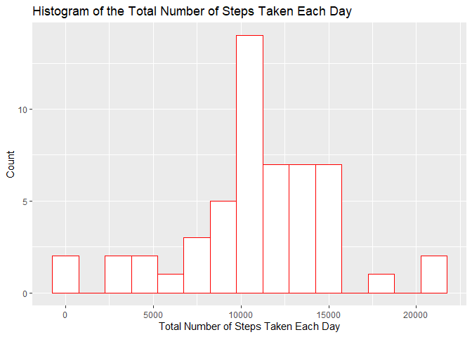
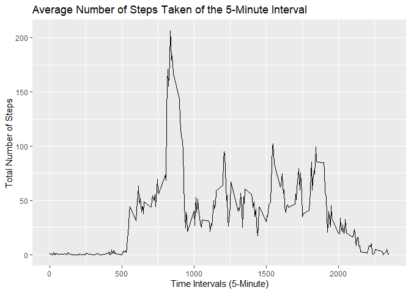
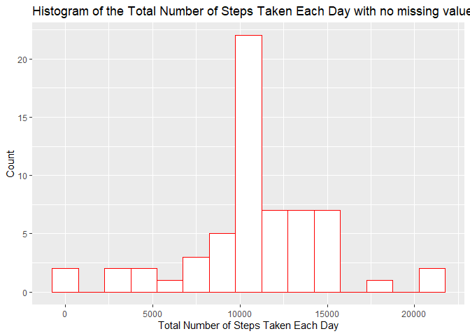
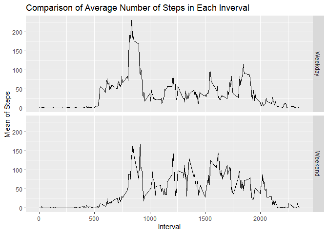

---
title: "Peer-G-A-Course Proj-1 working--Stu4"
author: "Phillip"
Each step is a learning journey in Data Analysis and Research.

## Assignment Instructions 

1. Code for reading in the dataset and/or processing the data
2. Histogram of the total number of steps taken each day
3. Mean and median number of steps taken each day
4. Time series plot of the average number of steps taken
5. The 5-minute interval that, on average, contains the maximum number of steps
6. Code to describe and show a strategy for imputing missing data
7. Histogram of the total number of steps taken each day after missing values are imputed
8. Panel plot comparing the average number of steps taken per 5-minute interval across weekdays and weekends
9. All of the R code needed to reproduce the results (numbers, plots, etc.) in the report

setwd("C:/Users/Phillip.Carter1/Documents/datasciencecoursera/github.com/pcart234/Reproducible-Research")
activity <- read.csv("activity.csv")


	
	
	
	## 1. Loading and preprocessing the data
	
	```r
	# Setting working directory
	#setwd("C:/Users/Phillip.Carter1/Documents/datasciencecoursera/github.com/pcart234/Reproducible-Research")
	
	data <- read.csv("activity.csv", header=TRUE, na.strings="NA")
	data <- transform(data, date = as.Date(date))
	head(data)
	```
	
	```
	##   steps       date interval
	## 1    NA 2012-10-01        0
	## 2    NA 2012-10-01        5
	## 3    NA 2012-10-01       10
	## 4    NA 2012-10-01       15
	## 5    NA 2012-10-01       20
	## 6    NA 2012-10-01       25
	```
	
	```r
	summary(data)
	```
	
	```
	##      steps             date               interval     
	##  Min.   :  0.00   Min.   :2012-10-01   Min.   :   0.0  
	##  1st Qu.:  0.00   1st Qu.:2012-10-16   1st Qu.: 588.8  
	##  Median :  0.00   Median :2012-10-31   Median :1177.5  
	##  Mean   : 37.38   Mean   :2012-10-31   Mean   :1177.5  
	##  3rd Qu.: 12.00   3rd Qu.:2012-11-15   3rd Qu.:1766.2  
	##  Max.   :806.00   Max.   :2012-11-30   Max.   :2355.0  
	##  NA's   :2304
	```
	
	## 2. Getting the mean total number of steps taken per day
	### 2.1. Calculating the total number of steps taken per day
	
	
	```r
	steps <- aggregate(data$steps, by=list(Date=data$date), FUN=sum)
	names(steps)[names(steps) == "x"] <- "Total"
	head(steps)
	```
	
	```
	##         Date Total
	## 1 2012-10-01    NA
	## 2 2012-10-02   126
	## 3 2012-10-03 11352
	## 4 2012-10-04 12116
	## 5 2012-10-05 13294
	## 6 2012-10-06 15420
	```
	
	### 2.2. Making a histogram of the total number of steps taken each day
	
	
	```r
	library(ggplot2)
	hist <- ggplot(data=na.omit(steps), aes(Total)) +
	geom_histogram(binwidth=1500, colour="red", fill="white") + 
	xlab("Total Number of Steps Taken Each Day") +
	ylab("Count") +
	ggtitle("Histogram of the Total Number of Steps Taken Each Day")
	print(hist)
	```
	
	<!-- -->
	
	### 2.3. Calculating and reporting the mean and median of the total number of steps taken per day
	
	
	```r
	mean(na.omit(steps$Total))
	```
	
	```
	## [1] 10766.19
	```
	
	```r
	median(na.omit(steps$Total))
	```
	
	```
	## [1] 10765
	```
	
	## 3. Getting the average daily activity pattern
	### 3.1. Making a time series plot of the 5-minute interval (x-axis) and the average number of steps taken, averaged across all days (y-axis)
	
	
	```r
	steps_by_min <- aggregate(steps ~ interval, data=data, FUN=mean)
	time_series_plot <- ggplot(data=steps_by_min, aes(x=interval, y=steps)) + 
	geom_line() +
	xlab("Time Intervals (5-Minute)") +
	ylab("Total Number of Steps") +
	ggtitle("Average Number of Steps Taken of the 5-Minute Interval")
	print(time_series_plot)
	```
	
	<!-- -->
	
	### 3.2. Getting the 5-minute interval that, on average across all the days in the dataset, contains the maximum number of steps
	
	
	```r
	steps_by_min[which(steps_by_min$steps == max(steps_by_min$steps)),]
	```
	
	```
	##     interval    steps
	## 104      835 206.1698
	```

	## 4. Imputing missing values
	### 4.1. Calculating and reporting the total number of missing values in the dataset

	
	```r
	sapply(X=data, FUN=function(x) sum(is.na(x)))
	```
	
	```
	##    steps     date interval 
	##     2304        0        0
	```
	
	### 4.2. Devising a strategy for filling in all of the missing values in the dataset
	#### Strategy: Use the mean for 5-minute interval to replace all the missing values in the dataset

	
	```r
	library(dplyr)
	```
	
	```
	## Warning: package 'dplyr' was built under R version 3.4.4
	```
	
	```
	## 
	## Attaching package: 'dplyr'
	```
	
	```
	## The following objects are masked from 'package:stats':
	## 
	##     filter, lag
	```
	
	```
	## The following objects are masked from 'package:base':
	## 
	##     intersect, setdiff, setequal, union
	```
	
	```r
	data_NA_replace <- function(x) replace(x, is.na(x), mean(x, na.rm=TRUE))
	```
	
	### 4.3. Creating a new dataset that is equal to the original dataset but with the missing data filled in

	
	```r
	data_without_NA <- data%>% group_by(interval) %>% mutate(steps=data_NA_replace(steps))
	data_new <- as.data.frame(data_without_NA)
	head(data_new)
	```
	
	```
	##       steps       date interval
	## 1 1.7169811 2012-10-01        0
	## 2 0.3396226 2012-10-01        5
	## 3 0.1320755 2012-10-01       10
	## 4 0.1509434 2012-10-01       15
	## 5 0.0754717 2012-10-01       20
	## 6 2.0943396 2012-10-01       25
	```
	
	```r
	summary(data_new)
	```
	
	```
	##      steps             date               interval     
	##  Min.   :  0.00   Min.   :2012-10-01   Min.   :   0.0  
	##  1st Qu.:  0.00   1st Qu.:2012-10-16   1st Qu.: 588.8  
	##  Median :  0.00   Median :2012-10-31   Median :1177.5  
	##  Mean   : 37.38   Mean   :2012-10-31   Mean   :1177.5  
	##  3rd Qu.: 27.00   3rd Qu.:2012-11-15   3rd Qu.:1766.2  
	##  Max.   :806.00   Max.   :2012-11-30   Max.   :2355.0
	```
	
	#### Counting missing values, now

	
	```r
	sum(is.na(data_new))
	```
	
	```
	## [1] 0
	```
	
	### 4.4. Making a histogram of the total number of steps taken each day, calculating, and reporting the mean and median total number of steps taken per day

	
	```r
	steps_new <- aggregate(data_new$steps, by=list(data_new$date), FUN=sum)
	names(steps_new)[names(steps_new) == "x"] <- "Total"
	names(steps_new)[names(steps_new) == "Group.1"] <- "Date"
	hist_new <- ggplot(data=steps_new, aes(Total)) +
	geom_histogram(binwidth=1500, colour="red", fill="white") + 
	xlab("Total Number of Steps Taken Each Day") +
	ylab("Count") +
	ggtitle("Histogram of the Total Number of Steps Taken Each Day with no missing values")
	print(hist_new)
	```
	
	<!-- -->
	
	#### Comparison and discussion about the data:

	
	```r
	mean(na.omit(steps$Total))
	```
	
	```
	## [1] 10766.19
	```
	
	```r
	median(na.omit(steps$Total))
	```
	
	```
	## [1] 10765
	```
	
	```r
	mean(steps_new$Total)
	```
	
	```
	## [1] 10766.19
	```
	
	```r
	median(steps_new$Total)
	```
	
	```
	## [1] 10766.19
	```
	
	#### The means of each dataset are same. The medians of each dataset are different.Therefore, the impact of imputing missing data on the estimates of the total daily number of steps has decayed on the value that separating the higher half from the lower half of dataset.
	
	## 5. Getting the differences in activity patterns between weekdays and weekends
	### 5.1. Creating a new factor variable in the dataset with two levels - "weekday" and "weekend" indicating whether a given date is a weekday or weekend day

	
	```r
	data_new$date <- as.Date(data_new$date)
	data_new$WeekdayOrWeekend <- ifelse(weekdays(data_new$date) %in% c("Monday", "Tuesday", "Wednesday", "Thursday", "Friday"), "Weekday", "Weekend")
	head(data_new)
	```
	
	```
	##       steps       date interval WeekdayOrWeekend
	## 1 1.7169811 2012-10-01        0          Weekday
	## 2 0.3396226 2012-10-01        5          Weekday
	## 3 0.1320755 2012-10-01       10          Weekday
	## 4 0.1509434 2012-10-01       15          Weekday
	## 5 0.0754717 2012-10-01       20          Weekday
	## 6 2.0943396 2012-10-01       25          Weekday
	```
	
	### 5.2. Making a panel plot containing a time series plot of the 5-minute interval (x-axis) and the average number os steps taken, averaged across all days or weekend days (y-axis)

	
	```r
	data_new <- (data_new %>% group_by(interval, WeekdayOrWeekend) %>% summarise(Mean=mean(steps)))
	ggplot(data_new, mapping=aes(x=interval, y=Mean)) +
	geom_line() +
	facet_grid(WeekdayOrWeekend ~.) +
	xlab("Interval") +
	ylab("Mean of Steps") +
	ggtitle("Comparison of Average Number of Steps in Each Inverval")
	```
	
	<!-- -->
	
	
